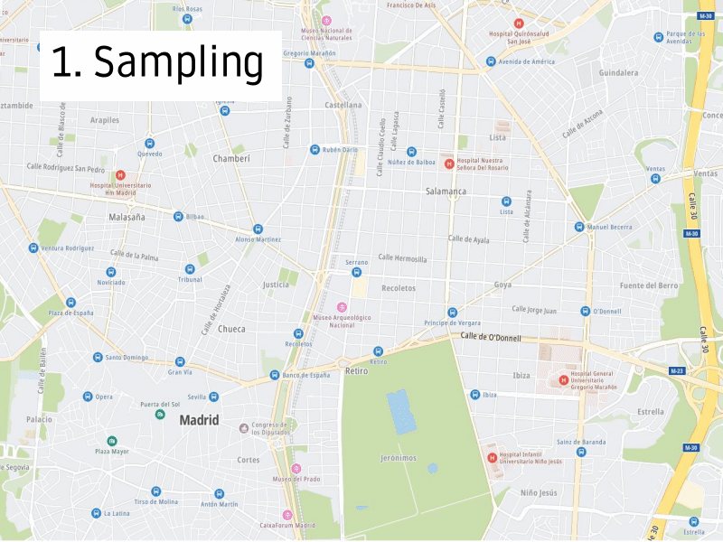

TbT Metric
==================

.. _github: https://github.com/tomtom-internal/github-maps-analytics-tbt

Technical documentation of the Turn by Turn (TbT) metric.

Contact persons:

+ `Juan Carlos Laria <mailto:juancarlos.laria@tomtom.com>`_
+ `Fernando Llodra <mailto:fernando.llodra@tomtom.com>`_
+ `Jonathan Suarez <jonathan.suarez@tomtom.com>`_
+ `Aitor Belaustegi <mailto:aitor.belaustegi@tomtom.com>`_
+ `Jose Luis Lavado <joseluis.lavadosanchez@tomtom.com>`_

Source code repository: `github`_.

.. toctree::
   :hidden:
   :maxdepth: 5

   launch
   dev
   data
   pipelines
   TbT python API <modules>

TbT definition
---------------

.. admonition:: Use case

   Evaluating navigation errors that a user will encounter when requesting instructions to go from point A to point B in the map

We consider the errors per hour (EPH) to measure navigation errors.

.. math::

   EPH = \frac{\# \textnormal{Errors Driven} }{ \textnormal{time (in hours)}}

A navigation error is an instruction that cannot be carried out in reality, and there are different main groups of errors, 

+ *Oneways* The route follows a wrong direction of traffic flow.
+ *Turn restrictions* The route includes a maneuver that is prohibited or impossible to do in reality.
+ *Non navigable geometry* The route follows a geometry that does not exists, is significantly misaligned (>20m) or is in general impossible to execute by a vehicle of type car in reality.

Examples
^^^^^^^^^

`MCP work instructions <https://confluence.tomtomgroup.com/display/~laria/WI_Navigation_Metric>`_

Indices and tables
==================

* :ref:`genindex`
* :ref:`modindex`
* :ref:`search`
