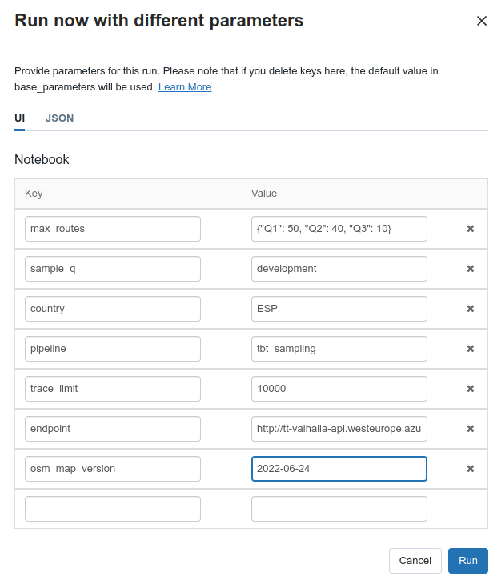
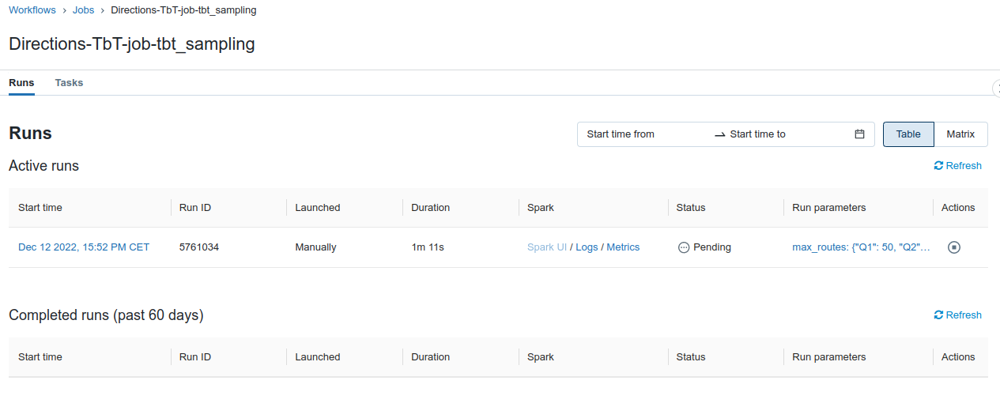
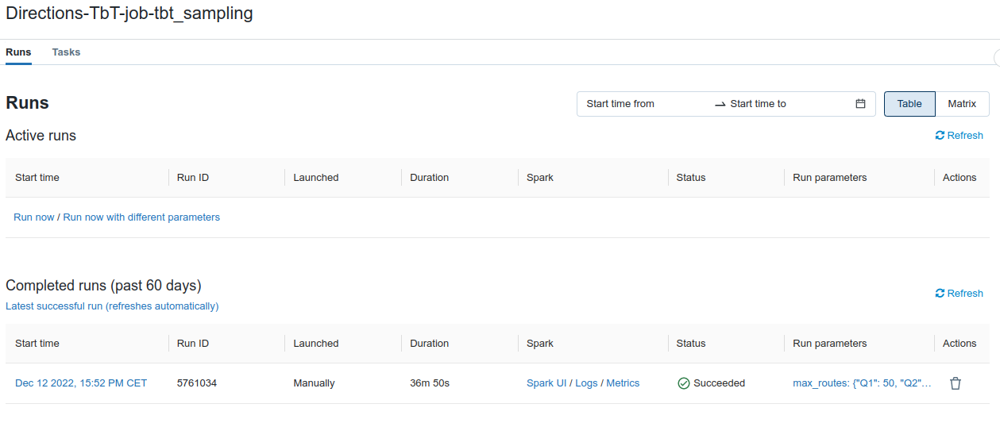
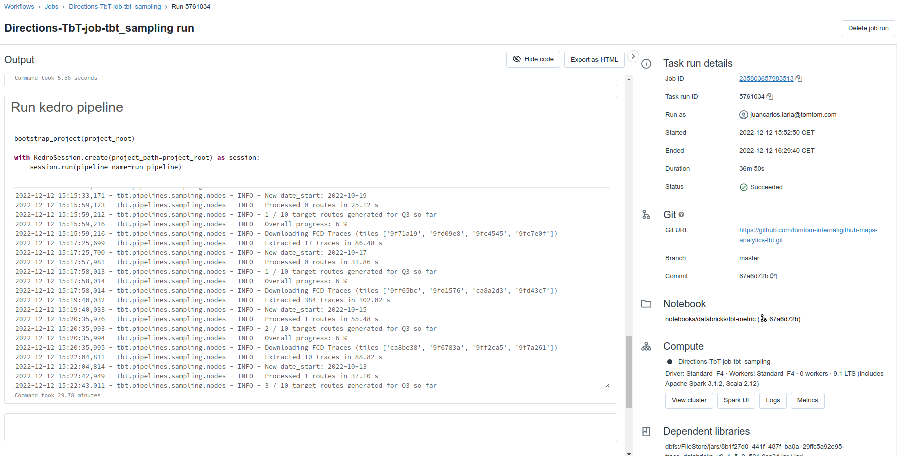
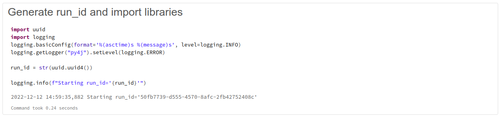
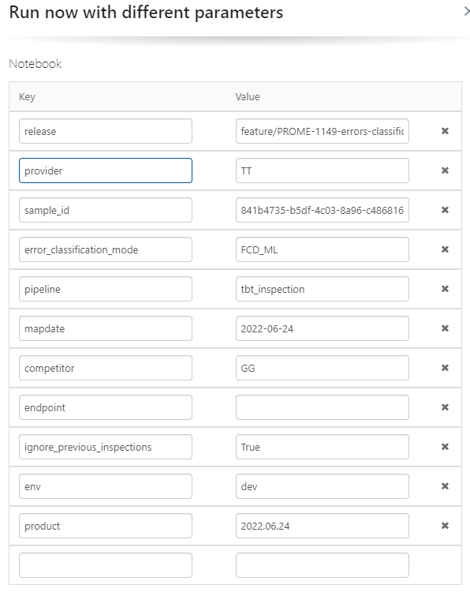
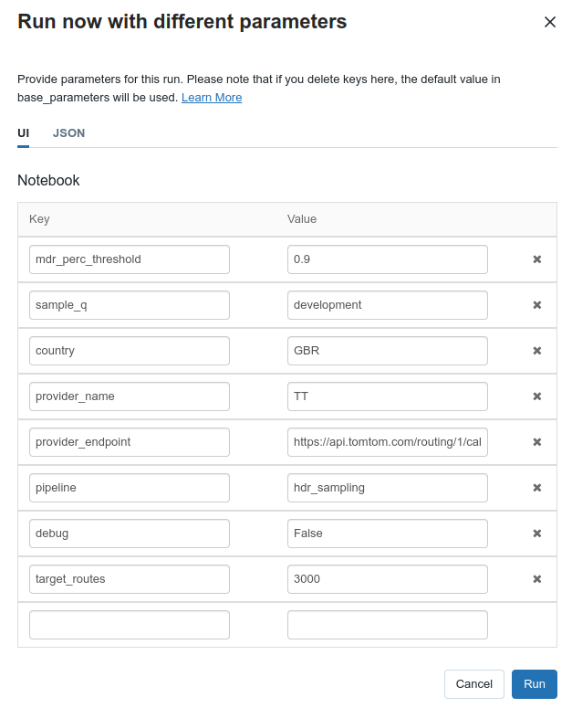

Launch TbT pipelines
=====================

This guide describes how to run TbT pipelines from Databricks, including

- a new sampling based on TbT 3.0
- a TbT 4.x inspection based on a sampling
- a new sampling based on Most Driven Roads
- manually trigger a metric computation process

New legacy sampling
---------------------

To generate a new TbT 3.0 sampling, open this `workflow <https://adb-8671683240571497.17.azuredatabricks.net/?o=8671683240571497#job/235803657983513>`_
and select `Run now with different parameters` to specify the correct input parameters.

.. seealso::

    :ref:`pipelines:New sampling`

Let's generate a new sampling with 100 routes in Spain 🇪🇸. Our input parameters are the following.

.. important::

    Notice that `max_routes` is `{"Q1": 50, "Q2": 40, "Q3": 10}` which is equivalent to `{"Q1": 50, "Q2": 40, "Q3": 10, "Q4": 0, "Q5": 0}` 
    because we want 50 routes for MQS=Q1, 40 for MQS=Q2 and 10 for MQS=Q3. 
    If the country had a different MQS range (e.g. Q2,Q3,Q4) then we would use the later layout.

.. hint::

    In this example, `sample_q` is `development` because we don't want to use `2022-Q4` or similar, to not affect the production quarterly samplings.

.. hint::
    
    The `endpoint` parameter is set to `http://tt-valhalla-api.westeurope.azurecontainer.io:8002/`, 
    which is an internal Valhalla OSM version from June 2022 at the time of writing this document.

Once we fill in the parameters, we click `Run` and a new ongoing sampling job will appear under `Active runs`.

After a while (36m 50s in this example) the job finishes and a new completed run will appear in the overview.

We can follow the link on the date of the run to check the code output and relevant step by step logs (that are available in the last cell).

The `sample_id` can be retrieved from the first cell output in the job run, `'50fb7739-d555-4570-8afc-2fb42752408c'` in this case.

✅ That's it! Now we know how to trigger legacy TbT 3.0 samplings.

TbT inspection
---------------

To generate a new TbT 4.x inspection (both new measurement and re-measurement), open this `workflow <https://adb-8671683240571497.17.azuredatabricks.net/?o=8671683240571497#job/799867113235275>`_
and select `Run now with different parameters` to specify the correct input parameters.

.. seealso::

    :ref:`pipelines:Inspection`

Let's run a new inspection with the routes in Spain generated in the previous example. Our input parameters are the following.

Once we fill in the parameters, we click `Run` and a new ongoing inspection job will appear under `Active runs`.

The `run_id` can be retrieved from the first cell output in the job run.

.. tip::

    Some useful combinations that will always work 😎

    - provider `TT` with endpoint `https://api.tomtom.com/routing/1/calculateRoute/` if we want to measure the latest Genesis
    - provider `OM` with endpoint `https://api.tomtom.com/routing/10/calculateRoute/` if we want to measure the latest Amigo Alpha
    - provider `OM_CUSTOM` with endpoint `http://{ENDPOINT}/routing/calculateRoute/` if we want to measure an Orbis NDS product
    - provider `OSM` with endpoint `http://tt-valhalla-api.westeurope.azurecontainer.io:8002/` if we want to measure OSM (not the latest)

.. hint::
    'errors_classification_mode' has 3 possibilities:
    
    - FCD: using FCD traces to compute the likelihood of the critical section.
    - ML: Machine learning model using internal (mainly geometrical) and external features as input to predict whether there is an error or not in the stretch.
    - FCD_ML: Machine learning model using also the probabilities computed by fcd_module as input for the model (on top of the previously mentioned features).

New sampling based on MDR
--------------------------

TbT 4.x metric includes Most Driven Roads (MDR) as a sub-metric. To generate MDR inspections, we create samples with `hdr_sampling` 
and inspect using `tbt_inspection`.

Let's generate a new sampling for MDR in GBR 🇬🇧 with 3000 routes.

Go to `Directions-TbT-job-hdr_sampling <https://adb-8671683240571497.17.azuredatabricks.net/?o=8671683240571497#job/374355587740250/runs>`_ and run with different parameters.

.. seealso:: :ref:`pipelines:Most Driven Roads sampling`

Metric computation
-------------------

There is a Databricks `job <https://adb-8671683240571497.17.azuredatabricks.net/?o=8671683240571497#job/827927526658061>`_ 
to run the metric computation pipeline. It runs every day, but if we need to, it can be manually triggered. 
It receives no input parameters, and makes changes in the tables only if there is a new inspection completed by MCP.

.. seealso:: :ref:`pipelines:Metric computation`, `WI_Navigation_Metric <https://confluence.tomtomgroup.com/display/~laria/Copy+of+WI_Navigation_Metric>`_

TbT WW Aggregation
---------------
To generate a WorldWide Aggregation metric, open this `workflow <https://adb-8671683240571497.17.azuredatabricks.net/?o=8671683240571497#job/799867113235275>`_
and select `Run now with different parameters` to specify the correct input parameters.

.. image:: gfx/tbt_aggregation_ww.png

Once we fill in the parameters, we click `Run` and a new ongoing inspection job will appear under `Active runs`.

The `run_id` can be retrieved from the first cell output in the job run.

**run_ids** refers to the inspections we want to aggregate. 
.. tip::
    - If I want to aggregate inspections for product 0000.00.00 for BEL, GBR & ZAF, I go to the database and grab the specific run_ids and paste them in this field

**base_run_id_ww** refers to a previous ww aggregation we want to use as base. 
.. tip::
    - Let's say that I have a worldwide aggregation from previous week and I only have new inspections for a few countries, so the rest of the values remain the same. In that case, as I only want to update a few countries' values, I can use a previous worldwide aggregation as a base. I choose the corresponding worldwide aggregation's run_id and put it in this field

**scope** refers to the extent of the aggregation. 
.. tip::
    - Values can be either 'WorldWide' or 'TopXX'
    - It is important to notice that WorldWide will use all the given inspections (through run_ids) and if there is any weight left unaggregated, it will assign a pessimistic estimation to it. On the other hand, using 'TopXX' option simply redistributes the 100% weight between the given inspections.

**provider**

**comment** field reserved for relevant remarks such as "Test", "Shadow inspection", etc...

**email** in case you want to receive a detailed report on the ww aggregation variation compared to the previous inspection.