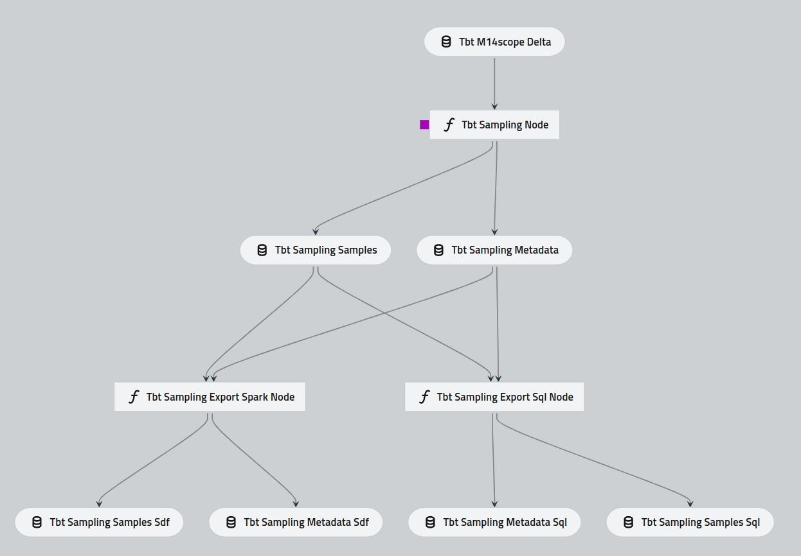
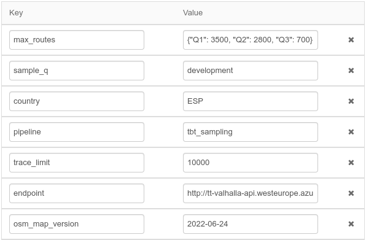
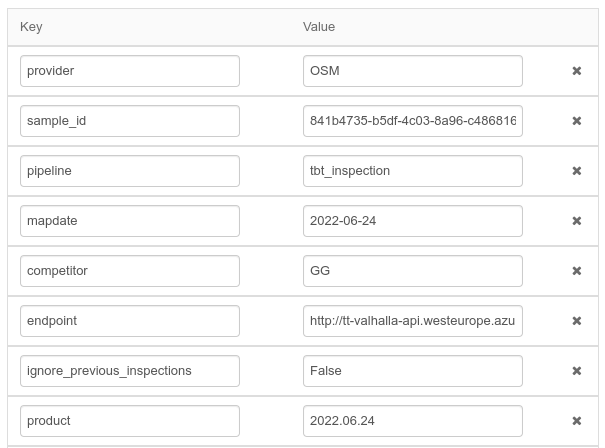
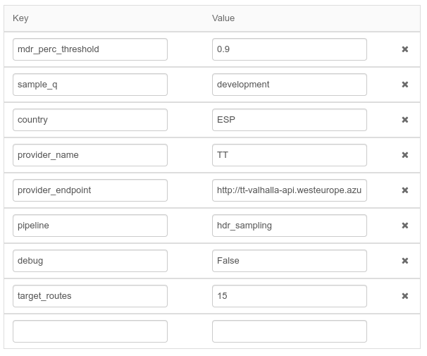

Pipelines
==========

New sampling
-------------

The pipeline `tbt_sampling` generates a new sampling that can be used for TbT and RouteR. It runs locally with

.. code-block:: bash

    kedro run pipeline=tbt_sampling

The `tbt_sampling` pipeline can be visualized with

.. code-block:: bash

    kedro viz --pipeline=tbt_sampling --port=8787 --autoreload --no-browser 

.. important::

    The `tbt_sampling` pipeline is the *legacy* sampling from TbT3.x that generates origins and destinations per Morton tile zoom 14.

The `tbt_sampling` pipeline can be triggered with the job `Directions-TbT-job-tbt_sampling <https://adb-8671683240571497.17.azuredatabricks.net/?o=8671683240571497#job/235803657983513>`_ 
and receives the following default input parameters.

max_routes
^^^^^^^^^^
JSON string with the desired number of target routes per MQS (Q1, Q2, Q3, Q4, Q5). The omitted MQS will default to zero.

sample_q
^^^^^^^^^
Sampling quarter, in the format `YYYY-QQ` (e.g. `2022-Q2` refers to second quarter of 2022). Also admits special codes such as `development` for 
samplings that are not going to be used in inspections to report. 

country
^^^^^^^^
ISO3 country code of the region where the sampling should be generated. This code refers to column `country` in table :ref:`data:M14Scope`. 
Therefore, it also admits other special codes, such as `US-CA` (California, USA) and `US-NY` (New York, USA).

trace_limit
^^^^^^^^^^^^
Maximum number of traces to use from each Morton tile 14 to randomly generate routes.

endpoint
^^^^^^^^^
Valhalla OSM endpoint with `/locate` and `/route` functionalities that are used to evaluate the candidate routes. 
By default the following filters are applied.

1. `/locate` should not return any value in `["motorway", "trunk", "primary", "cycleway", "service", "pedestrian", "track", "construction", "service_other", "path", "dirt"]` in `classification`, `use` or `surface` of the closest edge to the candidate origin/destination.
2. `/locate` should not return a `destination_only: true` edge.
3. `/route` should return a geometry.
4. `/route` should return more than 10 points.
5. `/route` should return a route between 100 and 2000 meters and more than 30 seconds long.

In other pipelines, endpoint refers to any routing engine, such as 

- TomTom's Directions `https://api.tomtom.com/routing/1/calculateRoute/`
- Amigo Alpha `https://api.tomtom.com/routing/10/calculateRoute/`
- Orbis/OSM Valhalla `http://10.137.172.19:8006/`
- OSM Valhalla `http://tt-valhalla-api.westeurope.azurecontainer.io:8002/`

.. tip::
    In TbT 4.x the `https://` or `http://` at the beginning and `/` at the end of the `endpoint` parameters are optional. However, they are recommended.

osm_map_version
^^^^^^^^^^^^^^^^
Metadata field to track the OSM map version used in :ref:`pipelines:endpoint`.

Inspection
-----------

The pipeline `tbt_inspection` runs a new TbT 4.x inspection. It runs locally with 

.. code-block:: bash

    kedro run pipeline=tbt_inspection

The `tbt_inspection` pipeline can be visualized with

.. code-block:: bash

    kedro viz --pipeline=tbt_inspection --port=8787 --autoreload --no-browser 

The overall workflow of the `tbt_inspection` pipeline is

1. Compute the provider routes with the origins and destinations included in this sampling. Inputs: :ref:`data:sampling_samples`.
2. If a route has no new changes with respect to a previous inspection, retrieve the information we have. Inputs: :ref:`data:inspection_routes`, :ref:`data:inspection_critical_sections`, :ref:`data:critical_sections_with_mcp_feedback`.
3. Compute the competitor's route for those routes that don't have the info.
4. Compute the Route Agreement Checker (RAC)
5. Compute the Route Feasibility Checker (RFC) with FCD.
6. Combine the information for this inspection and export to Delta Lake and Postgres. Outputs:  :ref:`data:inspection_routes`, :ref:`data:inspection_critical_sections`, :ref:`data:critical_sections_with_mcp_feedback`, :ref:`data:error_logs`, :ref:`data:inspection_metadata`.

Each of those steps has a node associated in the `tbt_inspection` pipeline.

The `tbt_inspection` pipeline can be triggered with the job `Directions-TbT-job-tbt_inspection <https://adb-8671683240571497.17.azuredatabricks.net/?o=8671683240571497#job/799867113235275>`_ 
and receives the following default input parameters.

provider
^^^^^^^^^
The map provider to evaluate. Possible values include

- `TT` (production TomTom's Directions routing API engine)
- `OSM` (Valhalla routing api with OSM)
- `OM` (Amigo Alpha routing API with the appropriate endpoint)
- `OM-VAL` (Valhalla routing api with Orbis)
- `Orbis-VAL` (Valhalla routing api with Orbis)
- `OSM-STRICT` (Valhalla routing api without buffer at the beginning/end of the route, the route starts and ends exactly where requested, which should be avoided in an inspection, since many implicit maneuvers will appear).

sample_id
^^^^^^^^^^

This is the unique identifier of a sample, and it is available in the :ref:`data:sampling_metadata` table. It can also be retrieved 
from the job that generated the sampling as the `run_id` (example: :ref:`launch:New legacy sampling`).

mapdate
^^^^^^^^

This is the date that we want to associate with this inspection when tracking product evolution later on.

competitor
^^^^^^^^^^^

The competitor that we want to compare with. TbT uses the proxy that if a route or sub-route the provider returns can be done with the competitor, 
then it is correct. We should always use `GG` as competitor, but other providers are allowed.

ignore_previous_inspections
^^^^^^^^^^^^^^^^^^^^^^^^^^^^

Defaults to `False` and should always be `False` unless we are running tests. When `True` the inspection is computed as a first measurement, 
even if it is not, with the costs in API calls and MCP tasks associated with a first measurement.

product
^^^^^^^^^

The product name to track this :ref:`pipelines:provider`. Some examples include, 

+ `2022.06.24` for `OSM` provider family
+ `2022.12.004` for `TT` family
+ `22490.000-Orbis-Enterprise-11` for `Orbis` family 

Most Driven Roads sampling
---------------------------

The pipeline `hdr_sampling` generates a new sampling based on MDR for the HDR/Golden/MDR metric.
It runs locally with

.. code-block:: bash

    kedro run pipeline=hdr_sampling

The `hdr_sampling` pipeline can be triggered with the job `Directions-TbT-job-hdr_sampling <https://adb-8671683240571497.17.azuredatabricks.net/?o=8671683240571497#job/374355587740250/runs>`_ 
and receives the following default input parameters.

mdr_perc_threshold
^^^^^^^^^^^^^^^^^^^

This is the minimum percentage of Km that we want a route to have in MDR to be part of the sampling. For example, a route that has 20Km total, 
with 15Km in MDR, has 75% in MDR. Any `mdr_perc_threshold` above 0.75 will ignore that route and not include it in the final sampling.

target_routes
^^^^^^^^^^^^^^

Number of routes that we want to sample. The process will adapt to this target, sampling routes with probability based on end-user behavior in the whole country.

.. important::

    Parameters `provider_name`, `provider_endpoint`, `pipeline` and `debug` are included for testing purposes and they should keep their default values.

Metric computation
-------------------

The pipeline `tbt_metric_calculation` computes the metric for completed TbT inspections. It runs locally with 

.. code-block:: bash

    kedro run pipeline=tbt_metric_calculation

.. topic:: Completed

    A TbT 4.x inspection is completed after all the tasks in :ref:`data:error_logs` have been reviewed and the inspection is marked as 
    `completed=True` in table :ref:`data:inspection_metadata`.

This pipeline outputs data to tables :ref:`data:critical_sections_with_mcp_feedback`, :ref:`data:scheduled_error_logs_history`, :ref:`data:scheduled_bootstrap` and :ref:`data:scheduled_metrics`.

The `tbt_metric_calculation` pipeline is triggered automatically with the job `Directions-TbT-job-tbt_metric_calculation <https://adb-8671683240571497.17.azuredatabricks.net/?o=8671683240571497#job/827927526658061>`_ 
and does not need any manual input parameters. It should run scheduled.

Split region by M14 tiles (legacy)
-----------------------------------

The pipeline `tbt_m14_split_region` populates table :ref:`data:M14Scope` with Morton tiles at zoom 14 for custom regions that are part of a current country.
For example, this pipeline should be triggered before :ref:`pipelines:New sampling` if we want to generate a new sampling of 3000 routes with scope limited to Florida, USA.
It should only run locally with

.. code-block:: bash

    kedro run pipeline=tbt_m14_split_region

after setting up the correct parameters in `conf/base/parameters/split_region.yml`.

Delete inspection
------------------

The pipeline `tbt_delete_inspection` deletes an inspection.
It is triggered with the job `Directions-TbT-job-tbt_delete_inspection <https://adb-8671683240571497.17.azuredatabricks.net/?o=8671683240571497#job/899282034561642/runs>`_ 
and receives the `run_id_to_delete` as input parameter.

.. important::

    This job in general should not be triggered unless we are sure we want to get rid of the information we have from an inspection

WW Aggregation
-------------------

The pipeline `tbt_aggregation_ww` computes the worldwide aggregation metric for completed TbT inspections. It runs locally with 

.. code-block:: bash

    kedro run pipeline=tbt_aggregation_ww

